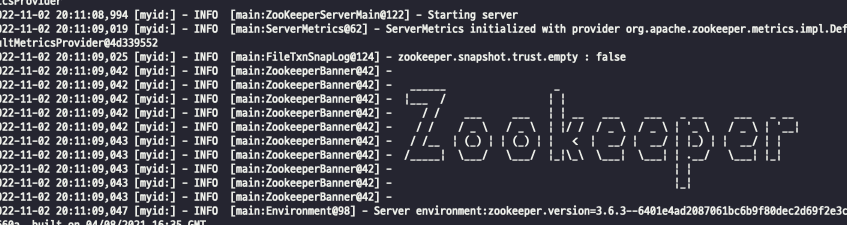
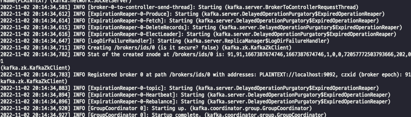

# 카프카 실행해 보기

1. 주키퍼를 설치 후, 실행해 줘야 한다.

```
https://zookeeper.apache.org/releases.html
```

2. 주키퍼를 실행합니다.

```
bin/zkServer.sh start-foreground
```

명령어로 실행시켜줍니다.



3. kafka를 설치합니다.

```
https://kafka.apache.org/downloads
```

4. kafka 실행합니다.

```
bin/kafka-server-start.sh config/server.properties
```



